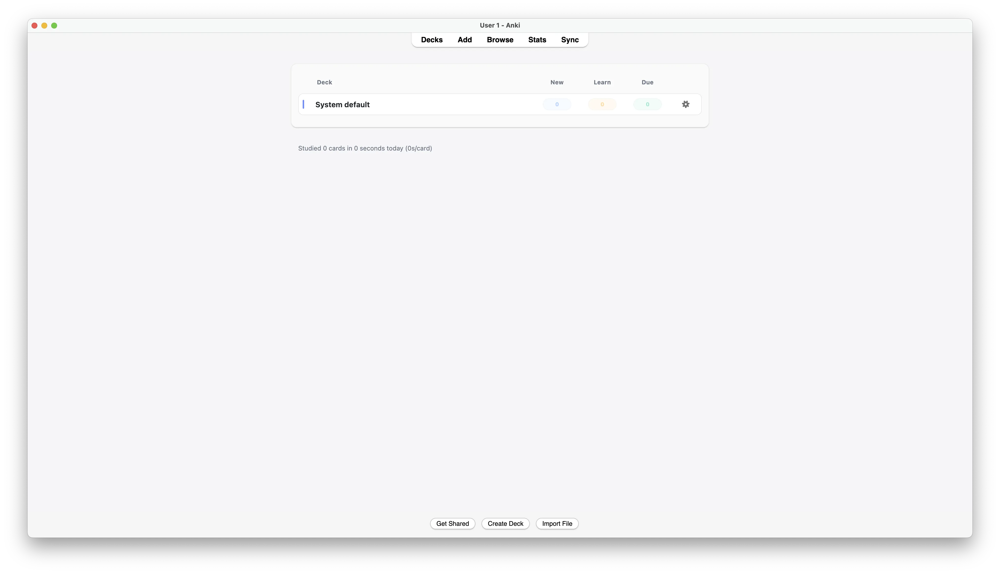
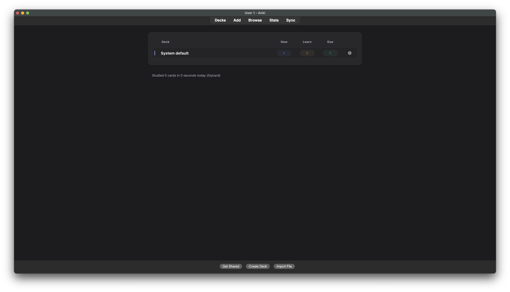

# Anki Theme - Minimalist UI Skin

[简体中文](README_zh.md)

A clean, modern theme addon for Anki that transforms the default interface into a polished, minimalist design with support for both light and dark modes.


## ✨ Features

- **Modern Minimalist Design** — Clean, flat UI with subtle shadows and smooth transitions
- **Light & Dark Mode** — Automatically adapts to Anki's native theme setting
- **Deck Browser Redesign** — Card-like deck rows with colored count pills (New/Learn/Due)
- **Consistent Styling** — Unified look across Deck Browser, Reviewer, and Overview screens
- **Native Qt Menu Styling** — Context menus (gear icon) match the overall theme
- **Compact Layout** — Optimized spacing for better information density

## 📸 Screenshots




## 🚀 Installation

### From AnkiWeb

966384781
[https://ankiweb.net/shared/info/966384781](https://ankiweb.net/shared/info/966384781)

## 🎨 Design System

### Color Options

Colors are defined separately for `light` and `dark` modes using hex codes:

```json
{
    "light": {
        "background": "#f6f6f7",
        "surface": "#ffffff",
        "accent": "#4f6ef7",
        "new": "#3b82f6",
        "learn": "#f59e0b",
        "due": "#10b981"
    },
    "dark": {
        "background": "#1c1c1f",
        "surface": "#242427",
        "accent": "#7aa2ff",
        "new": "#7aa2ff",
        "learn": "#ffcc66",
        "due": "#57d39a"
    }
}
```

See [`config.md`](config.md) for full documentation of all options.

> **Note:** After changing the config, restart Anki to apply changes.

## 🛠️ Technical Details

### Styled Components

- **Deck Browser** — Table layout, deck rows, count pills, gear icons
- **Qt Menus** — Native popup menus (gear icon context menu)

### How It Works

1. Injects CSS into Anki's webviews via `webview_will_set_content` hook
2. Applies Qt stylesheets (QSS) for native UI elements
3. Listens to theme changes to dynamically switch between light/dark modes

### Compatibility

- Anki 2.1+ (tested on 2.1.60+)
- Compatible with most other addons
- Designed to coexist with Review Heatmap and similar addons

## 📄 License

MIT License — feel free to modify and distribute.

## 🙏 Acknowledgments

- Inspired by modern UI design principles
- Built for the Anki community

---

**Enjoy a cleaner Anki experience!** ⚡
